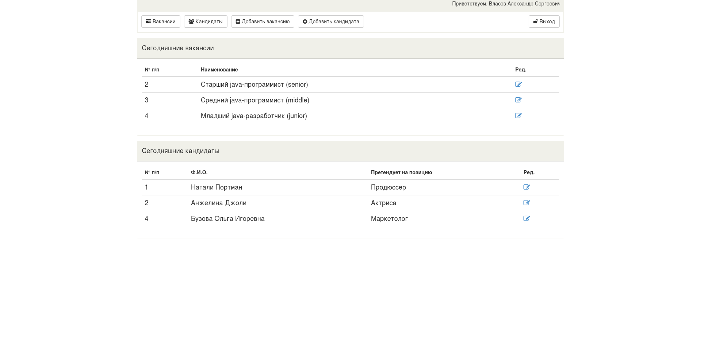
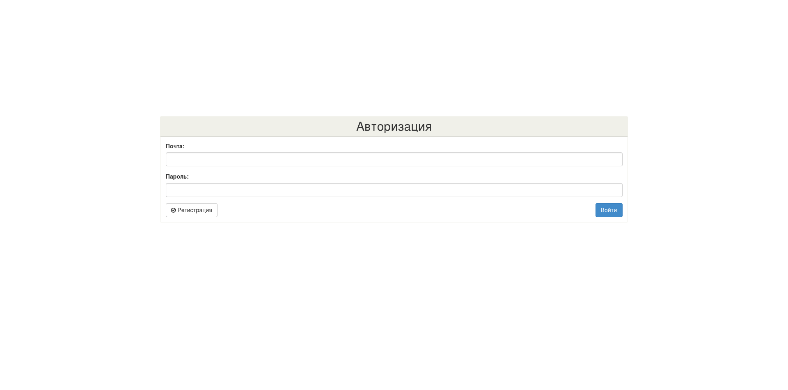
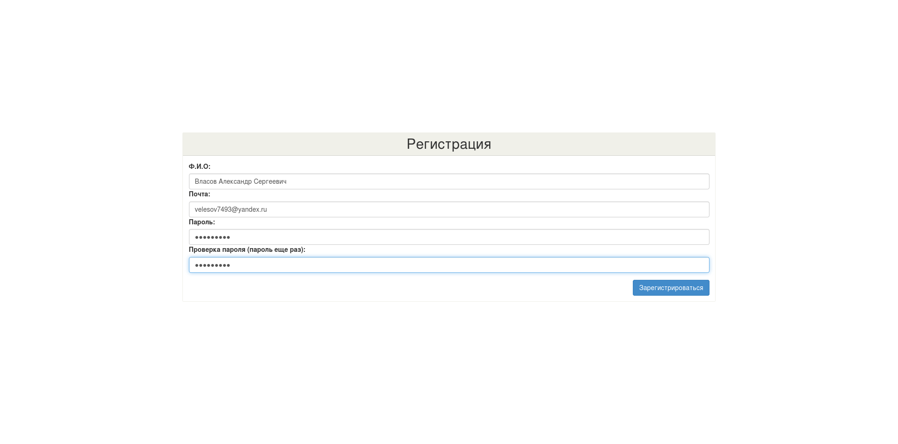
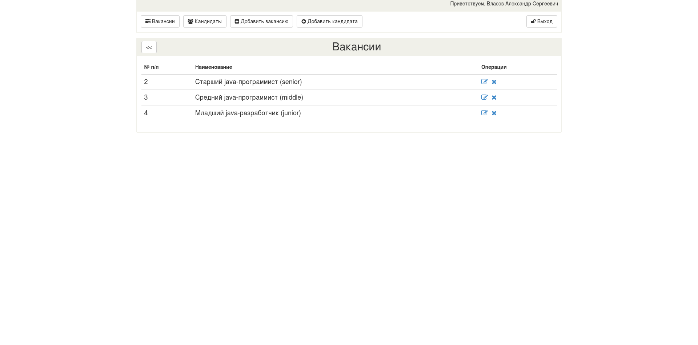
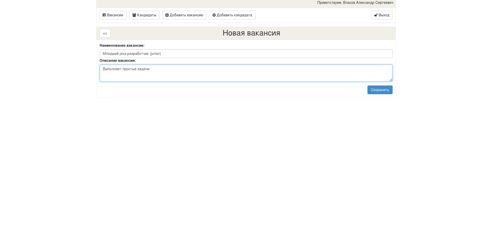
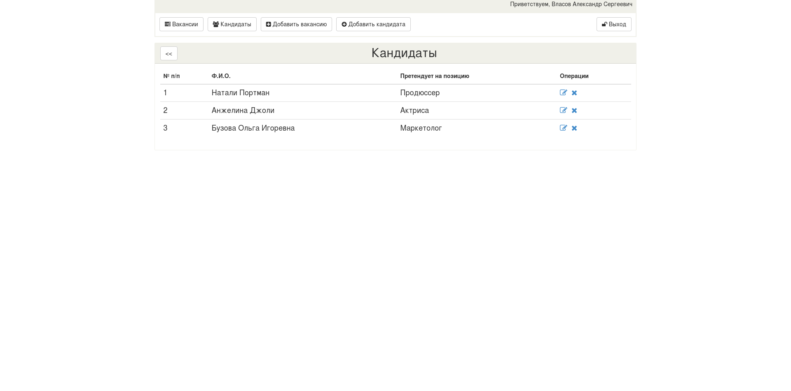
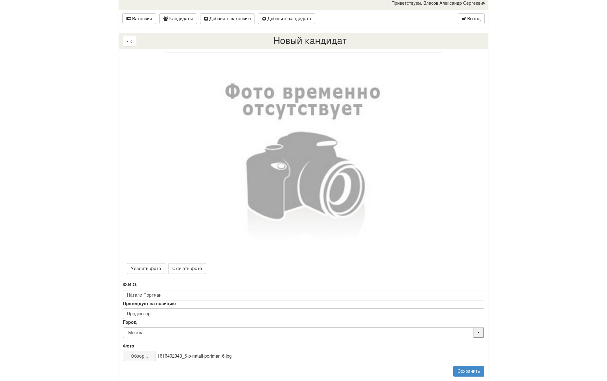

## Описание ##
Это учебный проект "Биржа вакансий" - веб-приложение с использованием java-сервлетов.

Авторизованный пользователь может редактировать вакансии и кандидатов.
#### Технологии проекта ####

## Страницы ##
#### Главная страница ####

#### Авторизация пользователя ####

#### Регистрация пользователя ####

#### Список вакансий ####

#### Редактирование вакансии ####

#### Список кандидатов ####

#### Новый кандидат ####

#### Редактирование кандидата ####
